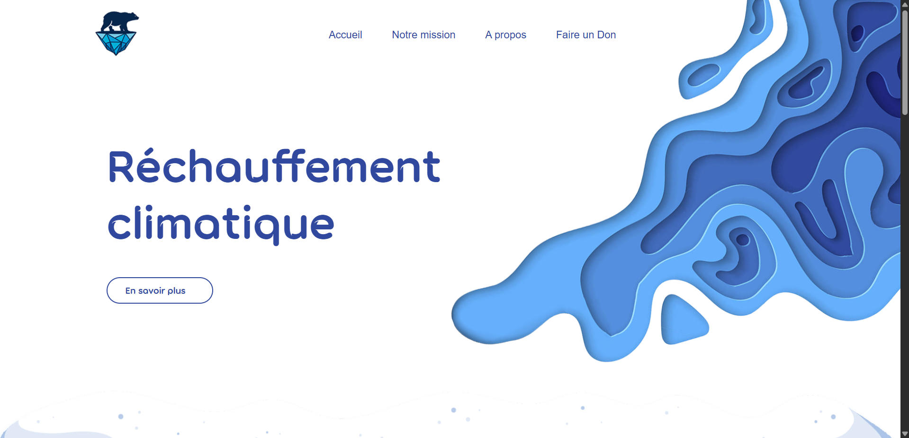
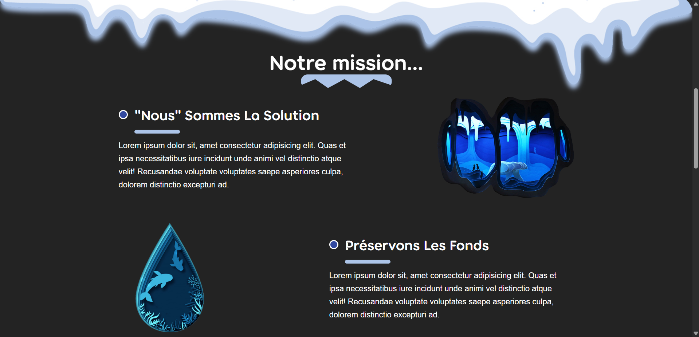
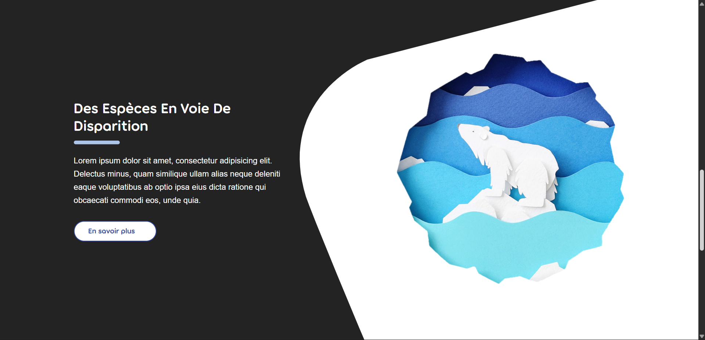
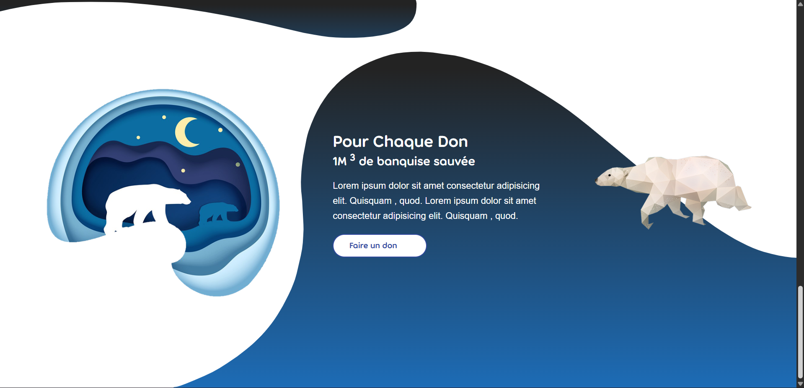

# 🌍 Projet Réchauffement Climatique

## 📖 Description

Ce projet est inspiré d’un tutoriel YouTube de **LiveCode**, mais ma réalisation est très différente.  
Je me suis servi du tutoriel comme point de départ, puis j’ai choisi de **coder à ma manière**, en modifiant la structure, le style et certaines techniques.

L’objectif n’était pas de reproduire à l’identique, mais de **comprendre les concepts** et de les adapter à ma vision personnelle.

---

## 🚀 Live Demo

👉 [Voir la page en ligne](https://anya-git.github.io/rechauffement-climatique/)

---

## 📂 Repository

👉 [Accéder au repo GitHub](https://github.com/AnYa-git/rechauffement-climatique)

---

## 📸 Screenshots

## Section 1
 
## Section 2
  
## Section 3
  
## Section 4

---

## 🎯 Objectifs pédagogiques

- Approfondir ma pratique du **HTML** et du **CSS**.
- Tester différentes approches de mise en page et d’animations.
- Développer ma propre méthodologie de travail, même en partant d’un support existant.
- Prendre l’habitude d’organiser et de partager mes projets sur **GitHub**.

---

## 🛠️ Technologies utilisées

- **HTML5**
- **CSS3**

---

## 🙏 Crédit

Projet initialement inspiré du tutoriel :  
📺 [LiveCode – Tutoriel](https://youtu.be/4eT9X64n8XU?si=XLXkL0x19gePvQkB)

---

## 🔮 Étapes futures

- Développer une version avec un **thème alternatif**.
- Ajouter des animations et transitions plus poussées.
- Améliorer encore le **responsive design** pour mobiles et tablettes.
- Expérimenter avec des **SVG personnalisés** et des effets plus créatifs.

---

✍️ Créé avec ❤️ par **Anya**
